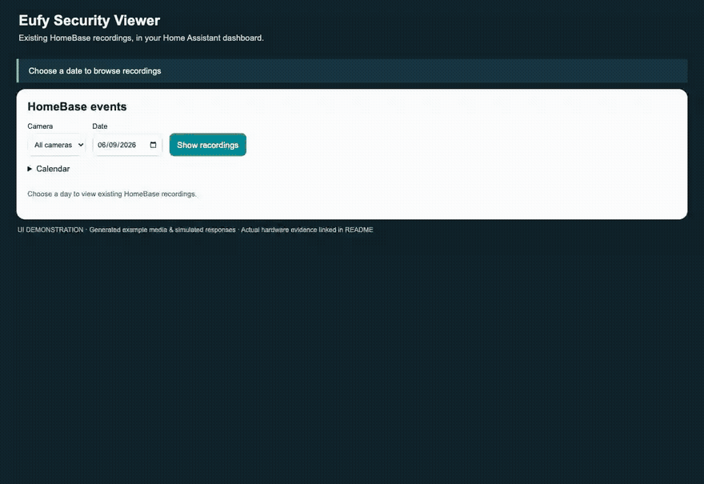

# Eufy Security Viewer

**Browse and play existing Eufy HomeBase recordings in Home Assistant.** Choose a date, filter by camera and play a stored event. Watch live video with optional sound when you need it; closing the viewer releases the stream.

An independent integration with bundled dashboard cards and a required local bridge. Not affiliated with or endorsed by Eufy or Anker. Built on [bropat's eufy-security-client](https://github.com/bropat/eufy-security-client).

[Install integration with HACS](https://my.home-assistant.io/redirect/hacs_repository/?owner=keesmod&repository=ha-eufy-cam&category=integration) · [Add bridge app repository](https://my.home-assistant.io/redirect/supervisor_addon_repository/?repository_url=https%3A%2F%2Fgithub.com%2Fkeesmod%2Fha-eufy-cam) · [Installation steps](#install-in-home-assistant-with-hacs) · [Tested compatibility](docs/COMPATIBILITY.md)



*UI demonstration with generated example media and simulated responses, using the released card. No private camera footage is published. Actual HomeBase playback evidence is documented in [validation](docs/VALIDATION_0.3.md). [Watch the MP4](docs/media/events-demo.mp4).*

**Start here:** Home Assistant **2026.9.0 or newer**, a Eufy account with camera access, and a **HomeBase 3** for the currently verified recording route. Install **both** parts: the bridge through the HA App Store (or Docker), then the integration through HACS. HACS currently uses a custom repository. Eufy login/cloud and push connectivity are still required; a cloud recording subscription is not required for the tested HomeBase files.

**Help confirm compatibility:** we're looking for the first **10 independent HomeBase 3 installations**. Follow the [short test checklist](docs/COMPATIBILITY.md#report-your-installation), then [report your result](https://github.com/keesmod/ha-eufy-cam/issues/new?template=compatibility.yml), including partial success. [Report a bug](https://github.com/keesmod/ha-eufy-cam/issues/new?template=bug_report.yml) if something fails.

[HACS default-catalogue request](https://github.com/hacs/default/pull/10690) is submitted; inclusion is pending review. You can install now using the custom-repository button above.

**Version 0.3.0:** an all-camera Events timeline with stored previews, a recording-day calendar, camera/date filters and previous/next playback. Includes on-demand WebRTC video and listen-only audio. Tested with Home Assistant 2026.9.0 and HomeBase 3 (T8030, firmware 3.8.6.0). Four camera entities and snapshots were verified on the live installation; actual WebRTC video and existing recording playback were verified at 1920×1080. See [validation and remaining limits](docs/VALIDATION_0.3.md). This is a HACS custom integration; it is not part of Home Assistant core.

## Events timeline

**Eufy Events** is a second card bundled in the same dashboard resource. It shows all your Eufy Viewer cameras in one timeline, with a camera filter, date selection, a calendar marking HomeBase recording days, existing-event previews, and previous/next playback. Add **Eufy Events** in the card picker; all accessible Viewer cameras are selected by default. Optional card configuration supports `entities` and `title`.

Requests begin with an explicit action. The card fetches at most 12 stored previews per displayed page, keeps at most 24 previews in browser memory and cancels work when hidden, disconnected or removed. Previews use the thumbnail path from the existing event; no snapshot capture or live recording is used. Calendar marks apply to all cameras on the HomeBase, and are only available to a user authorized for the entire bridge camera inventory. Filtering the timeline to a camera does not change the calendar's scope.

On the tested HB3, increasing the SDK's existing query limit retrieved 105 database rows for 5 September, including events beyond the original first 100. These contained 95 files from the four known cameras and 10 zero-byte rows outside that camera inventory. The day list grows through bounded requests instead of silently stopping at 100. If the HomeBase returns an unchanged full prefix, inconsistent IDs or reaches the safety ceiling, the UI reports that completeness could not be confirmed. Firmware outside the tested device may behave differently. See [0.3 validation](docs/VALIDATION_0.3.md).

HACS updates the integration and bundled cards; the companion bridge updates separately through the **HA App Store**. An old manually installed local bridge needs migration to the GitHub repository app before those bridge updates can be offered.

## What it does

- UI-only integration setup, reauthentication, endpoint reconfiguration, verification-code and captcha flows.
- Camera entities show Eufy's latest received snapshot; image requests never start a camera.
- A visual-editor Lovelace card starts WebRTC video with optional listen-only audio after a click or keyboard activation.
- Choose **Recordings → Date → Show recordings** to play an existing HomeBase event in Home Assistant. This reads stored events; it does not record a new live stream.
- Closing the dialog, leaving the dashboard, hiding the tab, disconnecting or failing to process frames releases the viewer.
- Multiple viewers of a camera share one upstream stream. Closing one viewer does not interrupt the others.
- The bridge independently expires silent viewers and stops the camera after the last viewer leaves.
- Push discovery and battery sensors, stable registry IDs, clean unload, English/Dutch UI and allowlisted diagnostics.
- No cloud polling timer: the pinned Eufy client is configured with `pollingIntervalMinutes: 0`. Login, push-triggered refreshes, token renewal and the library's local station communication still occur.

### Honest snapshot and streaming limits

A sleeping battery camera cannot provide a newly captured photo on every dashboard visit without waking. Idle views show the **latest received snapshot**. Its receive time is visible; it is not presented as capture time. If none exists, the card says so. New Eufy image events replace it. The last decoded live frame becomes the snapshot when viewing ends.

Live viewing uses **WebRTC video with listen-only audio** through Home Assistant's managed go2rtc. The bridge converts H.264/H.265 to browser-compatible H.264, up to **1920 pixels wide and 30 fps**, limited by the camera's source frame rate. Supported camera audio is converted to Opus. Playback starts muted; tap **Sound on / Geluid aan** to listen. A camera that supplies no supported audio remains video-only.

A normal HA camera card/more-info dialog shows snapshots only. Use the companion card for live video. Talkback, new live recordings, HLS, PTZ and permanent RTSP are not provided. Use **Recordings** on a companion card to choose a date and play an existing HomeBase recording. The date and times are HomeBase-local. Clips are downloaded on demand into bounded memory, then played as MP4; close or navigation cancels preparation. No Eufy Cloud subscription is required for these local files. The previous JPEG transport (8 fps / 960 pixels) remains supported for older bridge/card combinations; it has no sound.

WebRTC requires Home Assistant's **go2rtc integration** to be loaded and the browser to have a media route to HA (the managed service uses TCP port **18555**). A dashboard accessible through an HTTPS reverse proxy alone does not establish this media route. Routed LAN/VPN access can provide it; no public STUN/TURN service is configured by this integration. Do not expose the bridge API to solve WebRTC connectivity. See [0.2 validation](docs/VALIDATION_0.2.md).

Sessions have a **two-minute absolute limit**; continuing requires another tap. Normal close immediately issues stop. After a network partition or frozen page the bridge expires a viewer within **10 seconds**, plus its 250 ms watchdog tick. Startup without frames expires after 20 seconds. A bridge or host hard failure cannot deliver a stop command; camera firmware/P2P behavior in that case must be verified on the intended hardware. No software can promise instantaneous physical stop across a dead network.

## Install the bridge

Requirements: Docker on a machine that can reach the cameras/HomeBase, a dedicated Eufy account with shared camera access, and sufficient CPU for video transcoding. The container includes Node 24 and FFmpeg. One bridge manages one Eufy account. Do not share it with another system that starts or stops streams.

From the repository root:

```sh
docker build -t eufy-viewer-bridge:0.3.0 ./bridge
```

Create a private environment file with a randomly generated token of at least 32 characters:

```sh
umask 077
printf 'EUFY_BRIDGE_TOKEN=%s\n' "$(openssl rand -hex 32)" > bridge.env
```

Keep this file out of version control. Run the bridge, replacing `YOUR_LAN_IP` with the host's LAN address:

```sh
docker run -d --name eufy-viewer-bridge \
  --restart unless-stopped \
  --env-file bridge.env \
  -p YOUR_LAN_IP:8080:8080 \
  -v eufy-viewer-data:/data \
  eufy-viewer-bridge:0.3.0
```

Use a trusted LAN or a TLS reverse proxy; HTTP on an untrusted network exposes the bridge token and login credentials. Do not publish port 8080 to the internet. The browser never connects to the bridge directly. Outbound Eufy cloud/push and local P2P connectivity are required; depending on the device/network, Docker host networking may be needed for P2P.

The bridge stores its ID, Eufy credentials and session in `/data`, with private file permissions and asynchronous atomic writes. Back up that private volume. Loss of the volume creates a different bridge identity. Never attach it to bug reports. The bridge token is also stored by HA as a config-entry credential.

## Install in Home Assistant with HACS

### 1. Bridge app (Home Assistant OS)

[Add bridge app repository](https://my.home-assistant.io/redirect/supervisor_addon_repository/?repository_url=https%3A%2F%2Fgithub.com%2Fkeesmod%2Fha-eufy-cam)

1. Add this repository in **Settings → Apps → App store → Repositories** (called Add-ons on older HA versions).
2. Install **Eufy Security Viewer Bridge**. The first installation builds the container and can take several minutes. amd64 and aarch64 are supported; amd64 has been tested on hardware.
3. In its Configuration tab, set `token` to a unique randomly generated secret of at least 32 characters. Start the app and enable Start on boot.
4. Copy the app's **Hostname** from its Info tab. Use `http://HOSTNAME:8080` as the bridge URL in the integration below. Leave the network port disabled: Home Assistant reaches the app internally.

For HA Container installations, use the Docker instructions above instead. HACS installs the integration and bundled card; the bridge is a separate required app/container.

### 2. Integration and bundled card (HACS)

[Open in HACS](https://my.home-assistant.io/redirect/hacs_repository/?owner=keesmod&repository=ha-eufy-cam&category=integration)

This is a **HACS custom repository**, not yet a default HACS listing.

1. In HACS, add `keesmod/ha-eufy-cam` as a custom repository, category **Integration**.
2. Download **Eufy Security Viewer** and restart Home Assistant.
3. Open **Settings → Devices & services → Add integration → Eufy Security Viewer**.
4. Enter the bridge URL (for example `http://192.168.1.10:8080`) and its access token.
5. Enter the dedicated Eufy account's email, password and two-letter country code. Complete verification/captcha if requested.

For a local manual install, copy `custom_components/eufy_viewer` into your HA configuration's `custom_components` folder and restart. The downloadable integration archive preserves this directory structure.

## Upgrade from 0.1.0 or 0.2.0

1. Close live viewers and recording dialogs.
2. Update **Eufy Security Viewer Bridge** to **0.3.0** in the HA App store, then start it. For Docker, rebuild and recreate the container from this release while preserving its private data volume and token.
3. In HACS, update/download **Eufy Security Viewer 0.3.0** and restart Home Assistant. If the version is not shown yet, use the repository's **Redownload** action after checking for updates.
4. Change the existing dashboard resource to `/eufy_viewer/eufy-viewer-card.js?v=0.3.0`, type **JavaScript module**, and reload the dashboard/browser. Edit the existing resource; do not add a duplicate.
5. Add the **Eufy Events** card for the combined timeline, choose a date and select a clip. The existing **Recordings** button on camera cards still works. Use **Watch live** and **Enable sound** to test WebRTC/audio separately.

HACS updates the integration and bundled card only. The bridge must also run 0.3.0 for the Events timeline. Existing integration configuration, camera entities and credentials can be retained; no removal or re-pairing is needed. Verify the WebRTC media route described above if live playback does not connect.

## Add the card without YAML

The card is bundled with the integration, so it updates through the same HACS installation.

1. Enable **Advanced mode** in your HA profile if Resources is hidden.
2. In dashboard **Resources**, add URL `/eufy_viewer/eufy-viewer-card.js?v=0.3.0`, type **JavaScript module**.
3. Edit a dashboard, **Add card → Eufy Security Viewer**, and select a camera using the visual picker.
4. Save. The card stays on the snapshot until you tap it. Escape, the close button and clicking outside the dialog close live viewing.

After updates, reload browser resources. No YAML configuration, stream preload option, automation or scheduled service is needed. The integration deliberately does not advertise a generic stream source: another card cannot accidentally wake a camera through HA preload.

## Recovery and maintenance

- Use the integration's **Reconfigure** action when the bridge address or token changes. Its stable bridge ID must match.
- Complete the HA **Reauthenticate** flow if the Eufy account or bridge token requires attention.
- On bridge connection loss, entities become unavailable and all live viewers end. The local push socket reconnects with bounded backoff; media never automatically restarts.
- If a camera does not confirm stopping, the bridge makes at most three stop attempts. Once all viewers and pending starts have left, it makes one attempt to close the HomeBase connection and waits for confirmation before allowing playback again. A failed recovery keeps the affected session blocked. If the recording dialog says the previous live session is still stopping, wait about ten seconds and load the date again. Persistent failures require checking the bridge state; they do not trigger a polling or restart loop.
- A camera removed from Eufy becomes unavailable in HA; its registry entry is preserved so reappearance keeps IDs. Remove obsolete devices through HA's normal UI.
- Snapshot age is normal when there has been no new event. This integration does not wake a camera to make an old snapshot look fresh.

## Dependencies

| Component | Runtime requirements |
|---|---|
| Integration | Home Assistant ≥ 2026.9.0; built-in `camera`, `http`, `websocket_api`; `go2rtc-client` 0.4.0 (installed automatically); HA-managed `go2rtc` for WebRTC |
| Card | Bundled JavaScript, Home Assistant frontend and a modern browser; no separate frontend runtime package |
| Bridge | Node.js 24, FFmpeg and tini; all included in the app/container |
| Bridge libraries | `eufy-security-client` 4.1.1-1 (MIT), `ws` 8.21.3 (MIT); transitive dependencies pinned by `bridge/package-lock.json` |
| External services | Eufy account with camera access, Eufy cloud/push connectivity and local connectivity to camera/HomeBase |

No MQTT, separately installed RTSP server, existing Eufy integration or `eufy-security-ws` app is required. WebRTC uses HA's managed go2rtc and its FFmpeg audio conversion. Upgrade the bridge and integration together for the new transport. A dedicated shared Eufy account is recommended for ongoing use. Simultaneous operation with another Eufy client using the same account has only been briefly observed, not long-term validated. TypeScript, Playwright and Python test tools are development-only dependencies.

See [architecture and safety](docs/ARCHITECTURE.md), [bridge protocol](docs/PROTOCOL.md), [development](docs/DEVELOPMENT.md) and [validation](docs/VALIDATION.md).

## Existing HomeBase recordings

Confirmed on HomeBase 3 T8030, firmware 3.8.6.0, with eufy-security-client 4.1.1-1. The bridge uses the working calendar query `10006` with an empty device filter and `[selected day, next day]`, then filters returned records to the authorized camera. Legacy `10017` is not used. Only device-returned paths can be downloaded; the browser receives opaque expiring IDs.

The bridge expands the existing query limit to retrieve the selected day on the tested HB3 firmware. Ambiguous boundaries, inconsistent responses and the final safety ceiling are reported as errors instead of silent truncation. Firmware-wide pagination and bulk retention/export completeness are not claimed. One query or download runs at a time; close live viewers before loading recordings. Clip preparation is limited to 60 seconds and 32 MiB, with no persistent video cache. Failed requests require an explicit retry. See [recording protocol and live evidence](docs/RECORDINGS_PROBE_2026-09-06.md).
