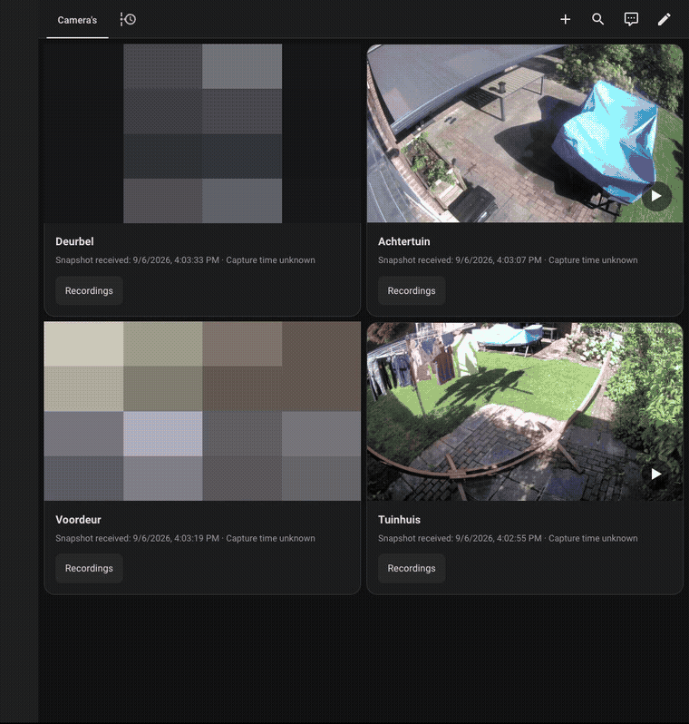

# Eufy Security Viewer

Browse and play Eufy HomeBase recordings in Home Assistant. Choose a date, filter by camera and play a stored event. You can also watch live video with optional sound. Closing the viewer releases the stream.

**You must install two parts:**

- **Eufy Security Viewer**, the Home Assistant integration and dashboard cards, installed through HACS.
- **Eufy Security Viewer Bridge**, a separate service that connects to Eufy and handles video. Install it as a Home Assistant OS app or run it in Docker on a machine on your network. HACS does not install or update the bridge.

On Home Assistant OS, the app runs on your HA machine and Home Assistant manages its container. You do not need to install Docker yourself. You can also put the bridge on a separate Docker host, for example to keep video processing off a Raspberry Pi.

[Installation](#installation) · [Docker instructions](docs/DOCKER.md) · [Tested compatibility](docs/COMPATIBILITY.md) · [Upgrading](#upgrading)



This demo shows the dashboard, event list and playback from a real installation. Private areas are obscured and the silent walkthrough is edited between actions. [Watch the MP4](docs/media/ha-dashboard-demo.mp4).

This project is independent of Eufy and Anker. Version 0.8.0 uses the independent [Eufy Mega client](https://github.com/keesmod/eufy-mega-client) as its only camera backend. **Breaking change: update the HA integration before the bridge.** Follow the [four upgrade steps](docs/MEGA_MIGRATION.md). Existing device identities and private backups are preserved. Support remains specific to the model, firmware and topology in the [compatibility evidence](docs/COMPATIBILITY.md).

Version 0.6.4 fixes missing recording audio on Apple players by including AAC decoder configuration in the MP4 header. Close and reopen prepared clips after updating the bridge.

Version 0.5.1 preserves H.265 recordings on capable players, with H.264 compatibility playback for other clients. Camera alerts and recognized names remain available; see [events and notifications](docs/NOTIFICATIONS.md).

## Before you start

You need:

- Home Assistant 2026.9.0 or newer, with [HACS installed](https://hacs.xyz/docs/use/download/download/).
- A Eufy account with access to your cameras and HomeBase. Use a dedicated account and share the devices with it in the Eufy app. Accept the invitation and confirm that account can see the devices before continuing.
- A machine to run the bridge, with access to Eufy's internet services and your cameras/HomeBase on the local network. The bridge includes Node.js and FFmpeg and needs enough CPU to convert live video.

Recording playback has been verified on HomeBase 3, model T8030, firmware 3.8.6.0. Other HomeBase models, standalone storage and firmware combinations still need testing. The HAOS app offers `amd64` and `aarch64` builds. Only `amd64` has been tested on hardware; 64-bit Raspberry Pi hardware testing is still pending. The app has no 32-bit ARM build. See [compatibility](docs/COMPATIBILITY.md) for the full limits.

A Eufy cloud recording subscription is not needed to play the tested HomeBase files. Eufy account login and cloud/push connectivity are still required.

## Camera capabilities

Bridge and integration 0.7.1 introduced per-camera snapshot, live and
recording capabilities from the Mega client. Available software is marked
experimental. Unsupported operations show a reason and cannot start media.
Older bridges without this optional metadata keep their existing behavior.
See [capability evidence](docs/CAMERA_CAPABILITIES.md) for validation and limits.
The unpublished integration 0.7.3 removes the generic experimental/hardware
warning from camera cards. It retains the 0.7.2 [candidate evidence](docs/CAMERA_RELEASE_CANDIDATE_0_7_2.md),
bridge 0.7.1 and client 0.10.0.

## Installation

Choose **one** bridge installation method, then install the integration and cards.

| Your setup | Where to install the bridge |
|---|---|
| Home Assistant OS, including a 64-bit Raspberry Pi | Use the HAOS app below to run it on your HA machine. See the hardware limits above. |
| Home Assistant Container | Follow the [Docker instructions](docs/DOCKER.md). |
| Home Assistant OS with the bridge on another machine | Follow the [Docker instructions](docs/DOCKER.md) on that machine, then return to step 2. |

### 1. Install the bridge on Home Assistant OS

The bridge comes from the Home Assistant **app store**, separate from HACS. Older HA versions call apps "add-ons".

1. Open **Settings → Apps → Install app** to open the app store.
2. Open the three-dot menu, select **Repositories**, paste this URL and select **Add**:

   ```text
   https://github.com/keesmod/ha-eufy-cam
   ```

3. Find **Eufy Security Viewer Bridge** in the new repository and select **Install**. The first installation builds the container and can take several minutes.
4. Open the app's **Configuration** tab. Set `token` to a unique, randomly generated secret of at least 32 characters, then save. A password manager can generate one. This token connects Home Assistant to the bridge; it is separate from your Eufy password. Keep it for step 2.
5. Start the app and enable **Start on boot**. Check its **Logs** tab if it fails to start.
6. App version 0.6.0 uses the bridge URL `http://127.0.0.1:8063`. It shares the HA host network and listens only on loopback. Older apps used `http://HOSTNAME:8080`; reconfigure the existing integration entry when upgrading.

Optional shortcut: [add the bridge app repository](https://my.home-assistant.io/redirect/supervisor_add_addon_repository/?repository_url=https%3A%2F%2Fgithub.com%2Fkeesmod%2Fha-eufy-cam). This opens My Home Assistant, which forwards you to your own HA instance. If it opens the wrong instance or fails, use the manual steps above. Home Assistant also documents [adding an app repository](https://www.home-assistant.io/common-tasks/os/#installing-a-third-party-app-repository).

Continue to step 2. Enter your Eufy email and password during integration setup, not in the bridge app configuration.

### 2. Install and connect the HACS integration

1. Open **HACS** in Home Assistant. In the three-dot menu, select **Custom repositories**.
2. Add `https://github.com/keesmod/ha-eufy-cam`, select type **Integration**, then select **Add**. See [HACS custom repository help](https://hacs.xyz/docs/faq/custom_repositories/) if needed.
3. Find **Eufy Security Viewer**, download it and restart Home Assistant.
4. Open **Settings → Devices & services → Add integration** and search for **Eufy Security Viewer**.
5. Enter the bridge URL and token from your bridge installation:

   | Bridge installation | URL to enter |
   |---|---|
   | HAOS app 0.6.0 on this HA machine | `http://127.0.0.1:8063` |
   | Older HAOS app through 0.5.1 | `http://HOSTNAME:8080`, using the app's hostname |
   | Docker | `http://DOCKER_HOST_LAN_IP:8080`, using the Docker host's LAN address |

   For Docker, use an address Home Assistant can reach. `localhost` would point at Home Assistant itself.

6. Enter the dedicated Eufy account's email, password and two-letter country code, such as `NL`, `GB` or `US`. Complete verification or captcha if prompted.
7. Check that your cameras appear under the integration. They show the latest received snapshot, which may be old or absent until a new image arrives.

Optional shortcut: [open this integration in HACS](https://my.home-assistant.io/redirect/hacs_repository/?owner=keesmod&repository=ha-eufy-cam&category=integration). The manual custom-repository steps above work without waiting for inclusion in the HACS default catalogue.

If you install integrations manually, copy `custom_components/eufy_viewer` from this repository into your HA configuration's `custom_components` folder and restart. You still need the bridge.

### 3. Add the dashboard cards

The cards are included with the integration. You do not need another HACS download.

From version 0.4.2, the integration registers the shared JavaScript resource automatically when it loads. It updates the cache version on upgrades and removes duplicate entries for this card. Other card resources are preserved.

1. Reload the browser after installing or updating the integration.
2. Edit a dashboard and select **Add card → Eufy Security Viewer**. Pick a camera and save.
3. To browse recordings across cameras, add an **Eufy Events** card too. It uses the same resource and selects all accessible Viewer cameras by default.
4. Open a live view, then close it. To check recordings, choose a date with a clip you can already see in the Eufy app and play that clip.

If automatic registration fails, enable **Advanced mode** in your HA profile and open **Settings → Dashboards → three-dot menu → Resources**. Add `/eufy_viewer/eufy-viewer-card.js?v=0.8.0` as a **JavaScript module** before adding the cards. Edit an existing entry instead of adding a duplicate. Releases up to 0.4.1 also need this manual step. Use your installed integration version after `?v=`. This value refreshes the browser cache; it does not select an older copy of the card.

If you manage resources in YAML, the integration leaves that configuration untouched. Add the module to your existing `lovelace.resources` list and update the version after upgrades:

```yaml
lovelace:
  resource_mode: yaml
  resources:
    - url: /eufy_viewer/eufy-viewer-card.js?v=0.8.0
      type: module
```

Keep any other resources already in the list. Reload YAML resources through Home Assistant, then reload the browser. A YAML dashboard can still use automatically managed resources when `resource_mode` is `storage`.

A standard Home Assistant camera card shows snapshots only. Use the included Eufy cards for live video and recording playback. No YAML, automation or stream preload setting is needed.

Live WebRTC video uses Home Assistant's [go2rtc integration](https://www.home-assistant.io/integrations/go2rtc/). HAOS and HA Container set it up automatically when using `default_config`. Your browser must also be able to reach HA's media service on TCP port **18555**. An HTTPS dashboard connection alone may not provide that route. Check [streaming requirements](#honest-snapshot-and-streaming-limits) if snapshots work but live video does not.

## Installation troubleshooting

| Problem | What to check |
|---|---|
| The bridge repository shortcut fails | Use the URL and manual app-store steps in step 1. Check that My Home Assistant points to your HA instance. |
| There is no Apps menu | The app instructions require Home Assistant OS. Use Docker for a Home Assistant Container installation. |
| The bridge app does not appear | Confirm you added the repository to the HA app store. Refresh the page and check your machine's architecture against the supported builds above. |
| The bridge will not start | Check its logs. The token must contain at least 32 characters. |
| Integration setup cannot connect | Start the bridge first. HAOS app 0.6.0 uses `http://127.0.0.1:8063`; older apps use their hostname on port 8080. For Docker, use the configured address reachable from HA. |
| Integration setup rejects the bridge token | Copy the same token configured in the app or in Docker's `bridge.env`. Do not enter the Eufy password in this field. |
| Eufy login succeeds but cameras are missing | Sign into the Eufy app with the dedicated account and check that it has accepted device-sharing access. |
| Live view fails immediately in the macOS app | Update the integration to 0.4.4, restart Home Assistant and refresh the dashboard in the app. Live video uses JPEG without audio. Use Safari for live audio. |
| Recordings stay black in the macOS app | Update the integration to 0.4.4, restart Home Assistant and refresh the app. Open Events, load the date and select a recording. No bridge update is needed from 0.4.1. |
| The cards do not appear | Check the resource URL and module type, then reload the browser. |

If the problem remains, [report a bug](https://github.com/keesmod/ha-eufy-cam/issues/new?template=bug_report.yml) with your HA installation type, both component versions and the error. Follow the [support guidance](.github/SUPPORT.md) before sharing logs.

## Upgrading

**0.8.0 is a breaking change and is currently an unpublished candidate.**
Update the HA integration first. It automatically prepares your device list for
the bridge update. Legacy users will need to sign in to Mega again.

Follow the [four short upgrade steps and recovery instructions](docs/MEGA_MIGRATION.md).
Keep your existing integration, token, bridge data and backup. Do not start two
bridges at once. The current published release remains 0.7.1 until a new release
has passed acceptance and is published.

A bridge under **Local apps** is a separate installation and is not updated by
the repository app. Keep its existing private data and token when moving it.
See [support](.github/SUPPORT.md) for older installations. Migration from a
different Eufy integration follows the [alarm migration checklist](docs/ALARM_MIGRATION_2026-09-06.md#moving-from-another-eufy-integration).

## Events timeline

**Eufy Events** is a second card bundled in the same dashboard resource. It shows all your Eufy Viewer cameras in one timeline, with a camera filter, date selection, a calendar marking HomeBase recording days, existing-event previews, and previous/next playback. Add **Eufy Events** in the card picker; all accessible Viewer cameras are selected by default. Optional card configuration supports `entities` and `title`.

Requests begin with an explicit action. The card fetches at most 12 stored previews per displayed page, keeps at most 24 previews in browser memory and cancels work when hidden, disconnected or removed. Previews use the thumbnail path from the existing event; no snapshot capture or live recording is used. Calendar marks apply to all cameras on the HomeBase, and are only available to a user authorized for the entire bridge camera inventory. Filtering the timeline to a camera does not change the calendar's scope.

On the tested HB3, increasing the SDK's existing query limit retrieved 105 database rows for 5 September, including events beyond the original first 100. These contained 95 files from the four known cameras and 10 zero-byte rows outside that camera inventory. The day list grows through bounded requests instead of silently stopping at 100. If the HomeBase returns an unchanged full prefix, inconsistent IDs or reaches the safety ceiling, the UI reports that completeness could not be confirmed. Firmware outside the tested device may behave differently. See [0.3 validation](docs/VALIDATION_0.3.md).

## What it does

- UI-only integration setup, reauthentication, endpoint reconfiguration, verification-code and captcha flows.
- Camera entities show Eufy's latest received snapshot; image requests never start a camera.
- A visual-editor Lovelace card starts live video after a click or keyboard activation. Supported clients use WebRTC with optional listen-only audio; clients without WebRTC use JPEG video.
- Choose **Recordings → Date → Show recordings** to play an existing HomeBase event in Home Assistant. This reads stored events; it does not record a new live stream.
- Closing the dialog, leaving the dashboard, hiding the tab, disconnecting or failing to process frames releases the viewer.
- Multiple viewers of a camera share one upstream stream. Closing one viewer does not interrupt the others.
- The bridge independently expires silent viewers and stops the camera after the last viewer leaves.
- HomeBase alarm and Guard Mode entities with station-confirmed commands and push status.
- Push discovery and battery sensors, stable registry IDs, clean unload, English/Dutch UI and allowlisted diagnostics.
- No cloud polling timer: the pinned Eufy client is configured with `pollingIntervalMinutes: 0`. Login, push-triggered refreshes, token renewal and the library's local station communication still occur.

### Honest snapshot and streaming limits

A sleeping battery camera cannot provide a newly captured photo on every dashboard visit without waking. Idle views show the **latest received snapshot**. The receive time remains available in the camera entity attributes; the card omits snapshot timestamps. If none exists, the card says so. New Eufy image events replace it. The last decoded live frame becomes the snapshot when viewing ends.

On supported clients, live viewing uses **WebRTC video with listen-only audio** through Home Assistant's managed go2rtc. The bridge converts H.264/H.265 to browser-compatible H.264, up to **1920 pixels wide and 30 fps**, limited by the camera's source frame rate. Supported camera audio is converted to Opus. Playback starts muted; tap **Sound on / Geluid aan** to listen. A camera that supplies no supported audio remains video-only.

A normal HA camera card/more-info dialog shows snapshots only. Use the companion card for live video. Talkback, new live recordings, HLS, PTZ and permanent RTSP are not provided. Use **Recordings** on a companion card to choose a date and play an existing HomeBase recording. The date and times are HomeBase-local. Clips are downloaded on demand into bounded memory, then played as MP4; close or navigation cancels preparation. No Eufy Cloud subscription is required for these local files.

Clients without WebRTC or video-frame callback support, including the Home Assistant macOS app, automatically use JPEG live video at up to **8 fps / 960 pixels**, without audio. The same explicit-start and stream cleanup rules apply. Use Safari on the Mac for WebRTC with live audio. Capability detection does not switch an existing WebRTC session to JPEG after a network or playback failure.

WebRTC requires Home Assistant's **go2rtc integration** to be loaded and the browser to have a media route to HA (the managed service uses TCP port **18555**). A dashboard accessible through an HTTPS reverse proxy alone does not establish this media route. Routed LAN/VPN access can provide it; no public STUN/TURN service is configured by this integration. Do not expose the bridge API to solve WebRTC connectivity. See [0.2 validation](docs/VALIDATION_0.2.md).

Sessions have a **two-minute absolute limit**; continuing requires another tap. Normal close immediately issues stop. After a network partition or frozen page the bridge expires a viewer within **10 seconds**, plus its 250 ms watchdog tick. Startup without frames expires after 20 seconds. A bridge or host hard failure cannot deliver a stop command; camera firmware/P2P behavior in that case must be verified on the intended hardware. No software can promise instantaneous physical stop across a dead network.

## Recovery and maintenance

- Use the integration's **Reconfigure** action when the bridge address or token changes. Its stable bridge ID must match.
- Complete the HA **Reauthenticate** flow if the Eufy account or bridge token requires attention.
- During startup, Home Assistant waits for the bridge to restore its saved Eufy session. Temporary network failures during initialization are retried automatically; they do not require entering your credentials again.
- On bridge connection loss, entities become unavailable and all live viewers end. The local push socket reconnects with bounded backoff; media never automatically restarts.
- If a camera does not confirm stopping, the bridge makes at most three stop attempts. Once all viewers and pending starts have left, it makes one attempt to close the HomeBase connection and waits for confirmation before allowing playback again. A failed recovery keeps the affected session blocked. If the recording dialog says the previous live session is still stopping, wait about ten seconds and load the date again. Persistent failures require checking the bridge state; they do not trigger a polling or restart loop.
- A camera removed from Eufy becomes unavailable in HA; its registry entry is preserved so reappearance keeps IDs. Remove obsolete devices through HA's normal UI.
- Snapshot age is normal when there has been no new event. This integration does not wake a camera to make an old snapshot look fresh.

## Dependencies

| Component | Runtime requirements |
|---|---|
| Integration | Home Assistant ≥ 2026.9.0; built-in `camera`, `http`, `lovelace`, `websocket_api`; `go2rtc-client` 0.4.0 (installed automatically); HA-managed `go2rtc` for WebRTC |
| Card | Bundled JavaScript, Home Assistant frontend and a modern browser; no separate frontend runtime package |
| Bridge | Node.js 24, FFmpeg and tini; all included in the app/container |
| Bridge libraries | `@keesmod/eufy-mega-client` 0.10.0 from its checksum-pinned GitHub release and `ws` 8.21.3. Mega retains MIT and Apache-2.0 attribution. Dependencies are pinned by `bridge/package-lock.json`. |
| External services | Eufy account with camera access, Eufy cloud/push connectivity and local connectivity to camera/HomeBase |

No MQTT, separately installed RTSP server, existing Eufy integration or `eufy-security-ws` app is required. WebRTC uses HA's managed go2rtc and its FFmpeg audio conversion. Upgrade the bridge and integration together for the new transport. A dedicated shared Eufy account is recommended for ongoing use. Simultaneous operation with another Eufy client using the same account has only been briefly observed, not long-term validated. TypeScript, Playwright and Python test tools are development-only dependencies.

Maintainers use the [validated release flow](docs/RELEASING.md) for both repositories. HACS updates the integration; the app store or Docker updates the bridge. A library release reaches HA only after a separately tested bridge release.

See [architecture and safety](docs/ARCHITECTURE.md), [bridge protocol](docs/PROTOCOL.md), [development](docs/DEVELOPMENT.md) and [validation](docs/VALIDATION.md).

## Existing HomeBase recordings

Previous release hardware evidence covers HomeBase 3 T8030 firmware 3.8.6.0 through Mega 0.10.0. New-build acceptance remains in camera #31. The bridge uses the working calendar query `10006` with an empty device filter and `[selected day, next day]`, then filters returned records to the authorized camera. Legacy `10017` is not used. Only device-returned paths can be downloaded; the browser receives opaque expiring IDs.

The bridge expands the existing query limit to retrieve the selected day on the tested HB3 firmware. Ambiguous boundaries, inconsistent responses and the final safety ceiling are reported as errors instead of silent truncation. Firmware-wide pagination and bulk retention/export completeness are not claimed. One query or download runs at a time; close live viewers before loading recordings. Clip preparation is limited to 60 seconds and 32 MiB, with no persistent video cache. Failed requests require an explicit retry. See [recording protocol and live evidence](docs/RECORDINGS_PROBE_2026-09-06.md).

### Live-stream diagnostics

In the bridge app configuration, enable `diagnostics: true`, save and restart
that app. The option defaults to false and older saved configurations may omit
it. Reproduce one live-view attempt and copy the lines containing
`"diagnostic":"live"` from the app logs. Disable the option and restart after
collecting the evidence. It applies to the Mega backend.

For Docker, set `EUFY_DIAGNOSTICS=true` and recreate the bridge container with
its existing data volume. Remove it or set it to `false` afterward.

Each attempt has a temporary number and elapsed milliseconds. `video_input`
and `audio_input` mean input bytes arrived, not that decoding succeeded.
`jpeg_frame` and `media_output` identify output from the two encoders.
`media_reader` means a client requested the media stream, not that it played.
`frame_ack` means the viewer acknowledged a delivered frame. `viewer_timeout`
means that acknowledgement deadline expired. `camera_timeout` means the
camera frame deadline or maximum viewing duration expired. `stream_failure`
is a general termination category. Encoder error, exit, invalid-data and
decode-error categories narrow the failure without exposing raw FFmpeg text.

Diagnostics emit each category once per attempt and never include device
identifiers, tokens, addresses, media grants, images or raw SDK/encoder errors.
Attempt numbers reset when the app restarts. Ordinary logs from other components
are outside this filter, so review any additional logs before sharing them.
This option does not change timeouts, keep cameras awake or enable SDK debug.

### Automatic live-video fallback

When WebRTC signaling, connection or playback fails, the viewer switches once
to live JPEG through the existing authenticated HA connection. The live popup
shows **Live video without sound** and hides its audio button. WebRTC is kept
when it works. The next explicit opening can try WebRTC again.

The bridge initiates fallback five seconds before the initial viewer deadline
(normally after 15 seconds for a new stream, or five seconds when joining an
existing stream), or six seconds without a subsequent playback acknowledgement.
These thresholds leave room to display JPEG within the existing 20/10-second
viewer deadlines. Switching
never extends those deadlines, starts another camera or resets the two-minute
maximum session lifetime. Hidden or disconnected viewers still expire.

Each viewer switches independently. Other viewers can continue using WebRTC.
HA logs a fixed fallback reason, and optional bridge diagnostics add matching
`fallback_*` categories. No raw ICE candidates, upstream error text or tokens
are logged. This does not add audio to JPEG or change network-provider terms.
Upgrade the integration and bridge together for this protocol capability.
