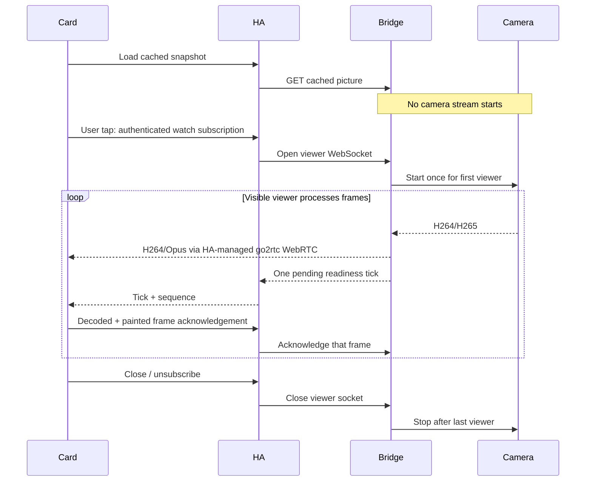

# Architecture and ownership

This is an architecture change built independently in a new directory. The old integration and live Home Assistant instance are outside the scope.

## Invariants

- Native camera image access performs only a read from bridge memory. No start action is exposed as a service or generic camera stream source.
- Starting requires a camera-specific authenticated HA WebSocket subscription. HA checks camera platform, availability and per-user entity read permission. Frame acknowledgements are scoped to the same connection and subscription, and matched to a monotonically increasing sequence.
- The card disables automatic resubscription. It releases late subscription results if the original dialog has closed and cancels on pagehide, visibility loss, intersection loss, removal, Escape, close or disconnection.
- At most one unacknowledged readiness tick (or legacy JPEG) travels per viewer. WebRTC acknowledgements require a fresh requestVideoFrameCallback from the video element. Duplicate/unsolicited acknowledgements cannot renew a lease. An inactive browser cannot be kept alive by a HA-generated heartbeat.
- The bridge owns reference counting, start/stop, the 10-second lease and the 120-second hard session cap independently of Home Assistant. A slow viewer cannot create an unbounded queue. Video buffers and parser output have hard limits.
- Two bridge FFmpeg processes per viewed camera produce the cached JPEG and WebRTC-compatible MPEG-TS feed; go2rtc converts AAC to Opus on demand. Unsupported audio is drained; processes are killed when the last viewer leaves or a decoder/transport error occurs. The newest live frame is retained as the idle snapshot.
- Ownership is inserted before `startStationLivestream` is invoked. Late starts after cancellation are stopped again. A stop command returning does **not** unlock the camera: the SDK's stop event does. New viewers are rejected while stopping. After three stop requests, a missing confirmation permits one transport-reset attempt only when no viewers or pending starts remain. The bridge sends the SDK station close and waits for its transport-close event, which clears queued commands; this is session teardown, not a physical stop acknowledgement. Until that confirmation, or if recovery fails, quarantine remains. New live starts are also blocked during recovery. Bounded stop retries are local device actions, not cloud polling.
- HA unload closes listeners and viewers. Local bridge reconnect never restores media. Bridge shutdown closes sockets and requests camera stops.
- Bridge token checks use constant-time equality. JSON/HTTP/WebSocket sizes are bounded. No URL, serial number, account, token, snapshot or raw event is included in diagnostics. Redirects are not followed for HTTP data requests.

## Boundaries and residual risks

A decoded-frame acknowledgement is a cooperative client signal, not proof a human is looking at the screen. No remote controller can guarantee physical stop through network partition or total power/process failure. The local watchdog bounds an absent viewer while the bridge is alive; firmware/P2P teardown behavior needs hardware acceptance testing. The 120-second SDK timer is process-local, not a camera-firmware guarantee.

The Eufy SDK is an unofficial reverse-engineered dependency. It may initiate login/token refresh, push-triggered cloud refresh and local station communication; `pollingIntervalMinutes: 0` disables its periodic cloud refresh. The bridge supplies `persistentData` and handles emitted persistence asynchronously, bypassing the SDK's synchronous persistent-file path. HA itself uses async aiohttp exclusively. FFmpeg work runs in a separate process.

This custom integration intentionally couples its live feature to a custom card. Core inclusion would need maintainer agreement about that frontend/API boundary and the unofficial protocol dependency, as well as published/stable library ownership and broader device evidence. The repository does not claim an official integration quality-scale tier.

## WebRTC boundary

HA creates a uniquely named ephemeral go2rtc stream for each viewer, relays SDP/ICE on the authenticated, permission-checked HA connection and removes that stream on cleanup. The bridge grants a random 256-bit media URL tied to the authenticated viewer socket. A media GET only consumes an existing stream: it cannot start a camera or renew a lease. Closing/expiring the viewer revokes the URL and closes its HTTP readers. No long-lived bridge token is embedded in a media URL. At most eight bounded HTTP readers share each camera feed; slow consumers are disconnected.

The browser connects to HA-managed go2rtc for media, never directly to the bridge. HA owns the go2rtc session; this integration closes only its own signaling socket and stream registration. The implementation uses the go2rtc connection exposed by HA 2026.9; compatibility with later HA internals needs CI and release checks. No external STUN/TURN service or persistent stream registration is created.
